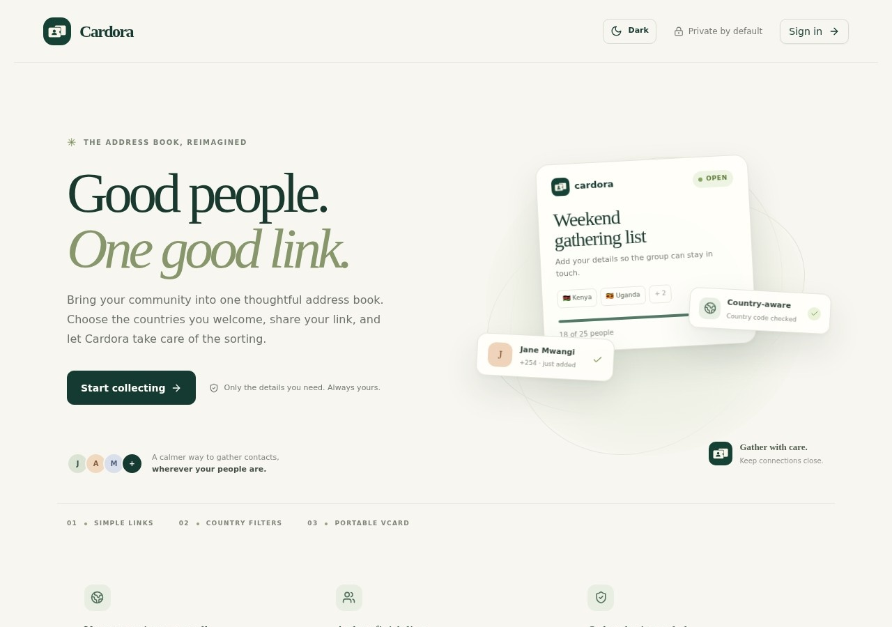

# Cardora

**A simple way to gather and manage contacts.** Create a collection link, invite people to add their details, and keep the resulting address book in one place.

[Visit Cardora](https://cardora.wolvarex.com)



## What Cardora does

- Create shareable contact-collection links with country rules and contact limits.
- Collect names and phone numbers with clear consent for email updates, SMS updates, and shared VCF downloads.
- Export a collection as a VCF contact file. Shared VCF links include contributors who opted in and expire after seven days.
- Send opted-in email updates through Brevo. Kenyan SMS uses the Nena gateway and is available to verified Kenyan account owners.
- Verify accounts at sign-up: Kenyan phone numbers use SMS; other countries use email verification. A phone number is required for every account.
- Review plan usage and payment history. Paid plans support M-Pesa STK Push in Kenya and card-only Paystack inline checkout. Plan payments cover the selected term and do not renew automatically.
- Manage plans, account quotas, collections, campaigns, and transaction statuses from the admin dashboard.

## Technology

React, Vite, TypeScript, Express, tRPC, PostgreSQL, and Drizzle ORM.

## Run locally

### Requirements

- Node.js 20.19+ or 22.12+ ([Vite 7 requirements](https://vite.dev/blog/announcing-vite7))
- pnpm 10.18+
- PostgreSQL

### Setup

1. Install dependencies and create a local environment file:

   ```sh
   pnpm install
   cp .env.example .env
   ```

   In Windows PowerShell, use `Copy-Item .env.example .env` for the second command.

2. Set `DATABASE_URL` in `.env` to a PostgreSQL database you can use for development. Set `APP_URL`, `CARDORA_APP_URL`, and `CARDORA_PUBLIC_ORIGINS` to `http://localhost:3000` for local work.

3. Apply the PostgreSQL migrations:

   ```sh
   pnpm db:migrate
   ```

4. Start Cardora:

   ```sh
   pnpm dev
   ```

   On Windows PowerShell, run the development command with the environment variable set first:

   ```powershell
   $env:NODE_ENV = "development"
   pnpm exec tsx watch server/_core/index.ts
   ```

   Open [http://localhost:3000](http://localhost:3000). The server uses port 3000 by default; set `PORT` to use another port.

### Integrations

Set provider credentials in `.env` when you need to test those features:

| Variable | Purpose |
| --- | --- |
| `BREVO_API_KEY`, `BREVO_SENDER_EMAIL` | Email verification and opted-in email campaigns. The sender must be verified with Brevo. |
| `NENA_API_KEY` | Kenyan phone verification and opted-in SMS campaigns. The Nena account must have an active sender. |
| `PAYSTACK_SECRET_KEY` | Production plan payments. Self-service Paystack checkout is disabled outside production. |
| `CARDORA_APP_URL` | Exact public HTTPS origin used for production Paystack checkout. |
| `CARDORA_PUBLIC_ORIGINS` | Allowed public origins for share and verification links; separate multiple origins with commas. |
| `GOOGLE_CLIENT_ID`, `GOOGLE_CLIENT_SECRET`, `GOOGLE_REDIRECT_URI`, `GMAIL_TOKEN_ENCRYPTION_KEY` | Optional Gmail sending integration. The callback must be `<origin>/api/cardora/google/callback`; the encryption key must decode to 32 bytes. |

`.env.example` contains safe placeholders. Keep real keys in the ignored `.env` locally and in the server's protected environment file. Never put server secrets in browser code or commit them.

## Plans and payments

- The default Free plan includes 100 accepted contacts across the account and one collection link. Each link also has its own capacity limit.
- Administrators manage plan prices, limits, availability, and user-specific quota overrides.
- Kenyan account owners can request an M-Pesa STK Push to a phone number they enter. Card checkout opens Paystack's inline card-only popup.
- Cardora verifies the payment reference, amount, and currency with Paystack before enabling the paid plan. Payments cover one monthly or yearly term; renewal is manual.
- The **Transactions** page shows each owner's payment history. **Admin → Transactions** lists all payments and supports search and status filtering (`starting`, `pending`, `paid`, and `failed`).

## Database and migrations

Cardora uses PostgreSQL. Apply committed migrations with `pnpm db:migrate`. When changing the Drizzle schema, `pnpm db:push` generates and applies a migration; review the generated PostgreSQL SQL before committing it.

The root-level `drizzle/*.sql` files are historical MySQL migrations. Do not apply them to PostgreSQL; use `drizzle/postgres`.

Existing legacy accounts can be enabled individually with `pnpm exec tsx scripts/migrate-legacy-email-account.ts`. The script requires the exact account ID and matching stored email, and prompts for explicit confirmation. Run it manually against the intended database; do not run it during application startup or routine deployment.

## Build and checks

```sh
pnpm check
pnpm test
pnpm build
pnpm start
```

The build serves the production Express API and the compiled client from `dist/`.

## Production deployment

The live application is served at [cardora.wolvarex.com](https://cardora.wolvarex.com). The VPS deployment uses `/var/www/cardora`, PostgreSQL, and the `cardora` systemd service. Keep production secrets in `/etc/cardora/cardora.env`, not in the repository.

For a routine deployment after pulling the intended Git commit:

```sh
cd /var/www/cardora
pnpm install --frozen-lockfile
pnpm db:migrate
pnpm build
systemctl restart cardora
systemctl is-active cardora
```

The application health endpoint is `https://cardora.wolvarex.com/api/health`.
